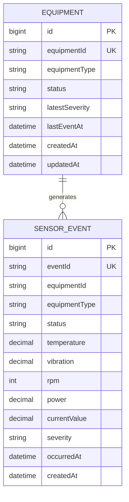
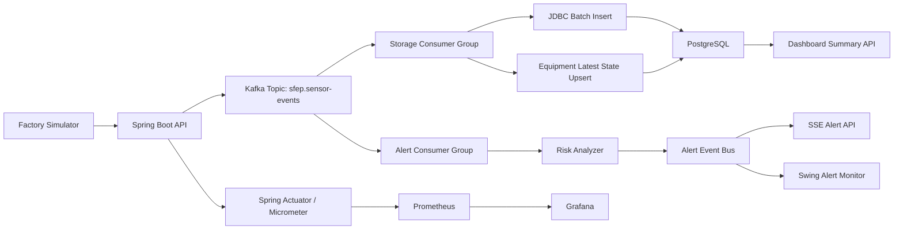
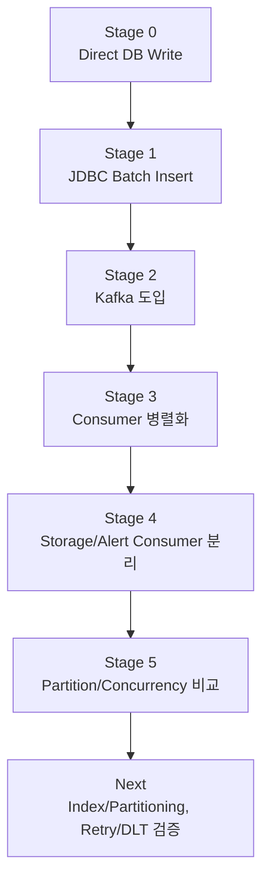

# SFEP Portfolio Notion Template

작성일: 2026-06-18

이 문서는 Arcane 포트폴리오 페이지와 같은 흐름으로 SFEP 프로젝트를 정리한 문서다.

Notion 포트폴리오에 붙일 때는 아래 구조를 그대로 사용하고, 각 기능 섹션 아래에 실행 화면 GIF 또는 스크린샷을 추가하면 된다.

---

## 📚 개요

---

>
> SFEP는 대규모 제조 설비 이벤트를 실시간으로 수집하고, 위험 이벤트를 감지하며, 저장 및 알림 흐름의 병목을 단계적으로 개선하는 대규모 이벤트 처리 시스템입니다.
>
> 제조 설비는 온도, 진동, RPM, 전력, 전류 등의 센서 데이터를 지속적으로 생성합니다. 하지만 단순히 데이터를 DB에 저장하는 것만으로는 운영 가치가 부족하며, 운영자는 어떤 설비가 위험한지 빠르게 확인하고 장애 원인을 추적할 수 있어야 합니다.
>
> 이를 위해 가상의 공장 설비 데이터를 생성하는 Factory Simulator를 만들고, Spring Boot 서버에서 이벤트를 수집한 뒤 Kafka, PostgreSQL, SSE, Swing Monitor, Prometheus/Grafana를 활용하여 저장 처리율과 알림 지연 시간을 측정할 수 있는 구조를 설계했습니다.
>
> 프로젝트는 처음부터 완성형 구조를 적용하지 않고, Direct DB Write부터 시작해 JDBC Batch Insert, Kafka 도입, Consumer 병렬화, 알림 Consumer 분리, Kafka partition/concurrency 비교까지 단계별로 병목을 찾고 개선하는 방식으로 진행했습니다.
>

---

## 📌 최종 핵심 성과

---

- 대규모 이벤트 처리 시스템을 설계하고, 100,000건 규모의 설비 이벤트를 기준으로 수집, 저장, 알림 흐름을 단계별로 개선했습니다.
- Direct DB Write 구조에서 발생하던 DB 저장 병목을 JDBC Batch Insert로 개선하여, 50,000건 기준 처리 시간을 **53,611ms -> 1,849ms**로 단축했습니다.
- 저장 처리율은 동일 조건에서 **933 events/sec -> 27,056 events/sec**로 향상되었습니다.
- Kafka 기반 비동기 처리와 Consumer 병렬화를 적용하여 API 요청 흐름과 저장 흐름을 분리했고, 약 **50,000 events/sec** 수준의 대량 이벤트 처리 구조를 검증했습니다.
- Storage Consumer와 Alert Consumer를 분리하여 DB 저장 병목이 알림 지연으로 전파되지 않도록 개선했고, 100,000건 기준 p95 알림 지연 시간을 **6,959ms -> 1,926ms**로 줄였습니다.
- Kafka partition/concurrency 조합 실험을 통해 단순 병렬화가 항상 성능 향상으로 이어지지 않으며, DB write 경합을 고려한 최적 조합이 필요하다는 점을 수치로 검증했습니다.

---

## ⭐️ 프로젝트 기능 및 시연

---

#### Factory Simulator

> 실제 제조 설비를 대신하여 가상의 설비 이벤트를 생성하는 기능입니다.
>
> 사용자는 설비 수, 설비당 이벤트 수, 장애 비율을 설정하여 원하는 규모의 이벤트를 생성할 수 있습니다. 예를 들어 설비 100대, 설비당 이벤트 10건을 설정하면 총 1,000건의 센서 이벤트가 생성되고 서버로 전송됩니다.
>
> 생성되는 이벤트는 설비 ID, 설비 유형, 온도, 진동, RPM, 전력, 전류, 발생 시각을 포함하며, 서버는 이를 기반으로 NORMAL / WARNING / CRITICAL 상태를 판단합니다.
>

> 시연 이미지/GIF 위치: Factory Simulator 실행 화면

#### Direct DB Write Monitor

> Spring Boot 서버 실행 시 함께 실행되는 Swing 기반 성능 측정 UI입니다.
>
> 가장 단순한 구조인 API Server -> PostgreSQL 직접 저장 방식의 한계를 확인하기 위해 만들었습니다. UI에서 설비 수와 이벤트 수를 설정하고 "보내기" 버튼을 누르면 이벤트가 DB에 저장되며, 저장 이벤트 수, 진행률, 소요 시간, 초당 처리율을 실시간으로 확인할 수 있습니다.
>
> 이를 통해 단순 CRUD 구현이 아니라, 직접 실험 조건을 바꾸며 병목을 수치로 확인하는 프로젝트임을 보여줄 수 있습니다.
>

> 시연 이미지/GIF 위치: SFEP Direct DB Write Monitor 화면

#### Real-time Alert Monitor

> 위험 이벤트 발생 시 별도의 Swing 창에서 실시간 알림을 표시하는 기능입니다.
>
> 알림에는 설비 ID, 설비 유형, 심각도, 온도, 진동, 전류, 이벤트 발생 시각, 알림 수신 시각, 알림 지연 시간이 포함됩니다. 이를 통해 단순 저장 성능뿐만 아니라 "운영자가 위험 상황을 얼마나 빨리 인지할 수 있는지"까지 측정할 수 있습니다.
>
> 특히 저장 경로가 느려져도 알림이 빠르게 도착하는지를 검증하기 위해 저장 Consumer와 알림 Consumer를 분리하는 구조로 개선했습니다.
>

> 시연 이미지/GIF 위치: SFEP Real-time Alert Monitor 화면

#### Kafka 기반 이벤트 처리

> Direct DB Write 구조에서 API 요청이 DB 저장 완료까지 기다리는 문제를 해결하기 위해 Kafka를 도입했습니다.
>
> API 서버는 이벤트를 Kafka topic에 발행하고, Storage Consumer가 이를 소비하여 PostgreSQL에 저장합니다. 이후 같은 topic을 Alert Consumer가 별도 Consumer Group으로 소비하여 위험 이벤트를 빠르게 판단하고 SSE/Swing 알림으로 전송합니다.
>
> 이 구조를 통해 이벤트 수집, 저장, 알림 흐름을 분리하고, Consumer concurrency와 Kafka partition 조합에 따른 성능 차이를 측정할 수 있게 되었습니다.
>

> 시연 이미지/GIF 위치: Kafka 처리 흐름 또는 로그 화면

#### Dashboard Summary API

> PostgreSQL에 저장된 설비 이벤트를 기반으로 현재 설비 수, 최근 1분 이벤트 수, WARNING 이벤트 수, CRITICAL 이벤트 수를 조회하는 API입니다.
>
> 이 API는 대시보드에서 전체 공장 상태를 빠르게 파악하기 위한 기능이며, 이후 Redis 최신 상태 캐싱과 PostgreSQL index/partitioning 적용을 통해 조회 성능을 개선할 수 있는 확장 지점으로 설계했습니다.
>

> 시연 이미지/GIF 위치: Dashboard Summary API 응답 또는 대시보드 화면

#### SSE 기반 실시간 알림

> 웹 클라이언트나 외부 모니터링 UI가 실시간 위험 이벤트를 수신할 수 있도록 SSE endpoint를 구성했습니다.
>
> 위험 이벤트가 발생하면 서버 내부 AlertEventBus를 통해 구독 중인 클라이언트로 알림이 전달됩니다. 현재는 SSE 기반으로 구성했으며, 이후 WebSocket, Slack, Email 알림으로 확장할 수 있습니다.
>

```text
GET /api/v1/alerts/stream
GET /api/v1/alerts/metrics
POST /api/v1/alerts/metrics/reset
```

#### 성능 측정 스크립트

> 동일한 조건으로 반복 실험할 수 있도록 Node.js 기반 benchmark script와 shell script를 작성했습니다.
>
> 단일 이벤트 처리량뿐만 아니라 Kafka publish 시간, Consumer 처리 시간, 전체 처리 시간, 저장 처리율, max lag, final lag, 알림 평균 지연, p95, p99 지연까지 측정합니다.
>

```text
node scripts/benchmark-sfep.mjs
scripts/run-performance-matrix.sh
scripts/run-partition-concurrency-matrix.sh
```

#### Prometheus / Grafana 모니터링

> Spring Actuator와 Micrometer를 통해 서버 지표를 Prometheus에 노출하고, Grafana에서 모니터링할 수 있도록 구성했습니다.
>
> 이를 통해 JVM, HTTP 요청, Kafka Consumer, DB connection pool 등 운영 지표를 확인할 수 있는 기반을 마련했습니다.
>

---

## 🙋‍♂️ 역할

---

- 대규모 이벤트 처리 시스템 전체 백엔드 아키텍처 설계
- Spring Boot 기반 이벤트 수집, 저장, 조회 API 구현
- Factory Simulator를 통한 가상 설비 이벤트 생성 구조 구현
- PostgreSQL 기반 센서 이벤트 저장 및 설비 최신 상태 upsert 구현
- Direct DB Write 구조의 기준 성능 측정 및 병목 분석
- JDBC Batch Insert 적용을 통한 DB write 성능 개선
- Kafka 기반 이벤트 발행/소비 구조 도입
- Storage Consumer와 Alert Consumer 분리를 통한 저장 경로와 알림 경로 분리
- Kafka partition / Consumer concurrency 조합별 성능 비교
- SSE 기반 실시간 위험 이벤트 알림 API 구현
- Swing 기반 성능 측정 UI 및 실시간 알림 모니터 구현
- Prometheus/Grafana 기반 운영 모니터링 구성
- 성능 측정 템플릿과 단계별 개선 문서 작성

---

## 🏛️ 시스템 아키텍처

---

#### ERD



#### 시스템 아키텍처



#### 성능 개선 실험 구조



---

## 💻 개선 사항

---

### 상황 1) Direct DB Write 구조에서 발생한 DB 저장 병목

---

### **📍 AS-IS**

초기 구조는 가장 단순한 `API Server -> PostgreSQL 저장` 방식이었습니다. Factory Simulator가 이벤트를 생성하면 Spring API가 요청을 받고, 이벤트를 바로 PostgreSQL에 저장했습니다.

이 구조는 구현이 단순하지만 이벤트 수가 증가할수록 API 요청 흐름이 DB insert 완료 시간에 직접 묶입니다. 설비 이벤트가 수천~수만 건으로 증가하면 API 응답 시간도 함께 늘어나고, DB connection pool과 insert 처리량이 전체 시스템의 병목이 됩니다.

실제 기준선 측정 결과, 10,000건 저장은 평균 약 **11,416ms**, 50,000건 저장은 평균 약 **53,611ms**가 소요되었습니다. 처리량은 대략 **900 events/sec** 수준에 머물렀습니다.

| 이벤트 수 | 평균 소요 시간 | 평균 처리율 |
| --- | ---: | ---: |
| 1,000 | 992ms | 1,015 events/sec |
| 10,000 | 11,416ms | 876 events/sec |
| 50,000 | 53,611ms | 933 events/sec |

### **📍 TO-BE**

초기 기준선을 먼저 측정한 뒤, 해당 구조의 한계를 포트폴리오의 출발점으로 정의했습니다. 이후 JDBC Batch Insert, Kafka, Consumer 분리 실험을 진행하기 위한 비교 기준으로 사용했습니다.

이 단계의 핵심은 성능이 좋게 나오게 만드는 것이 아니라, 가장 단순한 구조에서 병목이 어디에 생기는지 수치로 확인하는 것이었습니다.

---

### 상황 2) 개별 Insert 방식으로 인한 DB write 성능 저하

---

### **📍 AS-IS**

초기 저장 방식은 이벤트 1건마다 insert가 발생하는 구조였습니다.

```text
1 Event = 1 Insert
```

이 방식은 이벤트 수가 증가할수록 DB round-trip이 함께 증가합니다. 설비 이벤트가 대량으로 들어오는 환경에서는 insert 자체보다 insert 요청 횟수가 병목이 될 수 있습니다.

### **📍 TO-BE**

`JdbcTemplate.batchUpdate()` 기반 Batch Insert를 적용했습니다. 여러 이벤트를 한 번에 묶어서 DB에 저장하도록 변경하고, 설비 최신 상태는 upsert 방식으로 갱신했습니다.

```text
Before: 1 Event = 1 Insert
After : N Events = 1 Batch Insert
```

적용 후 10,000건 저장 시간은 **11,416ms -> 380ms**로 감소했고, 50,000건은 **53,611ms -> 1,849ms**로 감소했습니다. 100,000건도 약 **3,984ms**에 저장할 수 있었습니다.

| 이벤트 수 | 기존 Direct DB Write | JDBC Batch 적용 후 | 개선율 | 처리율 |
| --- | ---: | ---: | ---: | ---: |
| 1,000 | 992ms | 65ms | 93.4% | 15,745 events/sec |
| 10,000 | 11,416ms | 380ms | 96.7% | 26,373 events/sec |
| 50,000 | 53,611ms | 1,849ms | 96.6% | 27,056 events/sec |
| 100,000 | - | 3,984ms | - | 25,159 events/sec |

---

### 상황 3) API 요청 흐름과 DB 저장 흐름이 강하게 결합된 구조

---

### **📍 AS-IS**

JDBC Batch Insert를 적용해 저장 성능은 크게 개선되었지만, API 요청이 여전히 DB 저장 완료까지 기다리는 구조였습니다.

이 구조에서는 이벤트 유입이 폭증할 경우 API 서버가 DB 저장 지연의 영향을 직접 받습니다. 또한 저장 실패가 사용자 요청 흐름으로 전파될 수 있고, 장기적으로 수집과 저장을 독립적으로 확장하기 어렵습니다.

### **📍 TO-BE**

Kafka를 도입하여 API 서버는 이벤트를 Kafka topic에 발행하고, Storage Consumer가 비동기로 DB에 저장하도록 변경했습니다.

```text
API Server
-> Kafka publish
-> Storage Consumer
-> PostgreSQL
```

이를 통해 API 요청 흐름과 DB 저장 흐름을 분리했습니다. 100,000건 기준 Kafka 구조에서는 전체 처리 시간이 약 **5,427ms**, 저장 처리율은 약 **23,202 events/sec**로 측정되었습니다.

| 이벤트 수 | Kafka publish | Consumer 처리 | 전체 처리 | 저장 처리율 | 최종 Lag |
| --- | ---: | ---: | ---: | ---: | ---: |
| 1,000 | 204ms | 180ms | 385ms | 5,556 events/sec | 0 |
| 10,000 | 152ms | 601ms | 754ms | 16,639 events/sec | 0 |
| 50,000 | 595ms | 2,078ms | 2,674ms | 24,062 events/sec | 0 |
| 100,000 | 1,117ms | 4,310ms | 5,427ms | 23,202 events/sec | 0 |

---

### 상황 4) Kafka Consumer 병렬화 기준 부재

---

### **📍 AS-IS**

Kafka를 도입하더라도 Consumer가 하나의 흐름으로만 처리하면 Kafka topic에 쌓인 이벤트를 충분히 빠르게 소화하지 못할 수 있습니다.

하지만 Consumer concurrency를 무조건 늘리는 것도 정답은 아닙니다. Consumer가 많아지면 병렬 처리량은 증가할 수 있지만, DB write 경합이 커져 오히려 전체 처리 시간이 늘어날 수 있습니다.

### **📍 TO-BE**

Kafka partition 수와 Consumer concurrency 조합을 바꿔가며 100,000건 기준 성능을 측정했습니다.

측정 결과 `6 partitions / 3 concurrency` 조합은 저장 처리량이 가장 높았고, `6 partitions / 6 concurrency` 조합은 알림 p95 지연이 가장 낮았습니다. 반면 `12 partitions / 12 concurrency` 조합은 오히려 저장 처리량이 떨어져 PostgreSQL write 경합 가능성을 확인했습니다.

| case | partition | concurrency | totalMs | saveEPS | maxLag | alertAvg | alertP95 | alertP99 |
| --- | ---: | ---: | ---: | ---: | ---: | ---: | ---: | ---: |
| p6-c3 | 6 | 3 | 4,457ms | 34,435 | 88,729 | 1,090ms | 1,527ms | 1,567ms |
| p6-c6 | 6 | 6 | 4,732ms | 27,435 | 74,500 | 599ms | 1,074ms | 1,097ms |
| p12-c6 | 12 | 6 | 5,264ms | 25,927 | 81,564 | 852ms | 1,427ms | 1,536ms |
| p12-c12 | 12 | 12 | 6,330ms | 21,753 | 84,399 | 1,090ms | 1,773ms | 1,795ms |

이 실험을 통해 "병렬화를 많이 하면 무조건 빨라진다"가 아니라, Kafka Consumer와 DB 처리량의 균형을 찾아야 한다는 결론을 얻었습니다.

---

### 상황 5) DB 저장 경로와 위험 알림 경로가 결합된 구조

---

### **📍 AS-IS**

초기에는 위험 이벤트 알림이 저장 처리 흐름의 영향을 받을 수 있는 구조였습니다. 즉, DB 저장이 느려지면 위험 알림도 함께 늦어질 수 있었습니다.

대규모 이벤트 운영 시스템에서 중요한 것은 모든 데이터를 저장하는 것뿐 아니라, 위험 이벤트를 운영자에게 빠르게 전달하는 것입니다. 저장 처리량만 측정하면 실제 운영 관점의 핵심 지표인 알림 지연 시간을 놓칠 수 있습니다.

### **📍 TO-BE**

Storage Consumer와 Alert Consumer를 분리했습니다.

```text
raw-events
-> Storage Consumer Group -> PostgreSQL 저장
-> Alert Consumer Group   -> Risk 판단 -> SSE/Swing 알림
```

이 구조에서는 DB 저장이 느려져도 알림 Consumer가 같은 Kafka topic을 독립적으로 소비하기 때문에 위험 이벤트를 더 빠르게 전달할 수 있습니다.

100,000건 기준 Direct 알림 구조의 p95 지연은 약 **6,959ms**였지만, Kafka 기반 알림 Consumer 분리 후 p95 지연은 약 **1,926ms**로 감소했습니다.

| 방식 | 이벤트 수 | 전체 처리 시간 | 저장 처리율 | 알림 수 | 알림 평균 | 알림 p95 | 알림 p99 |
| --- | ---: | ---: | ---: | ---: | ---: | ---: | ---: |
| Direct | 100,000 | 7,000ms | 14,514 | 10,148 | 6,927ms | 6,959ms | 6,962ms |
| Kafka 분리 | 100,000 | 6,728ms | 21,222 | 10,073 | 1,246ms | 1,926ms | 1,998ms |

이를 통해 저장 성능과 알림 성능을 별도의 지표로 측정해야 한다는 점을 확인했습니다.

---

### 상황 6) 실시간 성능 측정과 운영 관점 모니터링 부족

---

### **📍 AS-IS**

처음에는 API 응답 시간이나 DB 저장 시간을 콘솔 로그로만 확인했습니다. 이 방식은 실험 조건을 바꾸며 비교하기 어렵고, 포트폴리오에서 "어떤 조건에서 어떤 성능이 나왔는지" 설명하기도 어렵습니다.

또한 위험 이벤트가 실제로 언제 발생했고, 언제 알림으로 도착했는지를 확인하기 어려워 알림 지연 시간 측정이 불가능했습니다.

### **📍 TO-BE**

Swing 기반 Direct DB Write Monitor와 Real-time Alert Monitor를 만들었습니다. 또한 성능 측정 스크립트를 작성하여 매번 같은 기준으로 측정할 수 있도록 했습니다.

알림 지연 시간은 다음 흐름으로 측정했습니다.

```text
이벤트 발생 시각
-> Kafka 수신
-> Risk 판단
-> SSE/Swing 알림 도착
```

측정 지표는 평균, p95, p99로 정리했습니다.

```text
평균 알림 지연
p95 알림 지연
p99 알림 지연
```

이를 통해 단순히 "빨라졌다"가 아니라, 어떤 지표가 얼마나 개선되었는지 단계별로 설명할 수 있게 되었습니다.

---

### 상황 7) 장애 대응 구조와 재처리 흐름 부재

---

### **📍 AS-IS**

Kafka Consumer 처리 중 DB 장애나 일시적인 예외가 발생하면 이벤트가 제대로 저장되지 않거나 재처리 흐름이 명확하지 않을 수 있습니다.

대량 이벤트 처리 시스템에서는 실패가 발생하지 않는 것이 아니라, 실패했을 때 어떻게 재시도하고, 최종 실패 이벤트를 어떻게 추적할지가 중요합니다.

### **📍 TO-BE**

Kafka Error Handling 설정을 추가하여 Retry와 DLT 기반 구조를 준비했습니다.

```text
DB 장애 발생
-> Consumer retry
-> 계속 실패 시 DLT 이동
-> 복구 후 재처리 가능
```

현재는 구조를 준비한 단계이며, 다음 단계에서는 PostgreSQL 장애를 의도적으로 발생시킨 뒤 retry 횟수, DLT 이동 여부, 복구 후 재처리 가능성을 측정할 계획입니다.

---

### 상황 8) 이벤트 이력 조회 성능 최적화 필요

---

### **📍 AS-IS**

현재까지의 핵심 실험은 이벤트 저장 처리율과 알림 지연 시간에 집중했습니다. 하지만 실제 운영 플랫폼에서는 저장된 이벤트를 빠르게 검색하고, 특정 설비의 장애 이력을 조회하는 기능도 중요합니다.

이벤트 데이터가 수십만~수백만 건으로 증가하면 단순 조회는 느려질 수 있고, 시간 범위와 설비 ID 기준 검색에서 병목이 발생할 가능성이 있습니다.

### **📍 TO-BE**

다음 단계에서는 PostgreSQL index와 partitioning을 적용하여 이벤트 이력 조회 성능을 개선할 계획입니다.

검증 대상은 다음과 같습니다.

- equipmentId + occurredAt 복합 인덱스
- severity + occurredAt 인덱스
- occurredAt 기준 range partitioning
- 최근 이벤트 조회 p50 / p95 / p99 측정

이후 Redis 최신 상태 캐싱을 적용하여 Dashboard Summary API의 조회 부하를 PostgreSQL에서 분리할 수 있습니다.

---

## 📊 핵심 성능 요약

---

| 개선 단계 | 핵심 내용 | 주요 결과 |
| --- | --- | --- |
| Stage 0 | Direct DB Write 기준선 | 10,000건 11,416ms, 50,000건 53,611ms |
| Stage 1 | JDBC Batch Insert | 10,000건 380ms, 50,000건 1,849ms |
| Stage 2 | Kafka 도입 | 100,000건 전체 처리 5,427ms, 최종 lag 0 |
| Stage 3 | Consumer 병렬화 | 약 50,000 events/sec 수준의 처리량 검증 |
| Stage 4 | Storage/Alert Consumer 분리 | 100,000건 알림 p95 6,959ms -> 1,926ms |
| Stage 5 | Partition/Concurrency 비교 | p6-c3 저장 처리율 34,435 eps, p6-c6 알림 p95 1,074ms |

---

## 🧩 프로젝트를 통해 확인한 핵심 결론

---

- 대량 이벤트 처리에서는 API 성능보다 DB write 구조가 먼저 병목이 될 수 있습니다.
- Batch Insert만 적용해도 저장 처리량은 큰 폭으로 개선됩니다.
- Kafka를 도입하면 API 요청 흐름과 저장 흐름을 분리할 수 있습니다.
- Consumer concurrency는 무조건 높을수록 좋은 것이 아니라, DB 처리량과 균형을 맞춰야 합니다.
- 저장 경로와 알림 경로는 분리해야 운영자가 위험 상황을 빠르게 인지할 수 있습니다.
- 성능 개선은 "감"이 아니라 기준선 측정, 병목 정의, 개선, 재측정 순서로 진행해야 합니다.

---

## 🚀 다음 개선 방향

---

- PostgreSQL index/partitioning 적용 후 이벤트 이력 조회 성능 측정
- Redis 최신 설비 상태 캐싱을 통한 Dashboard API 응답 시간 개선
- Kafka Retry / DLT 장애 시나리오 실험
- DB 장애 발생 시 Consumer 재처리 흐름 검증
- WebSocket 또는 Slack 알림 확장
- Grafana Dashboard 구성 고도화
